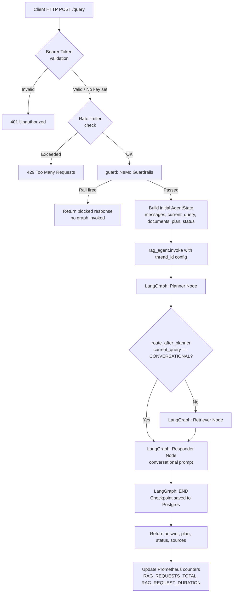
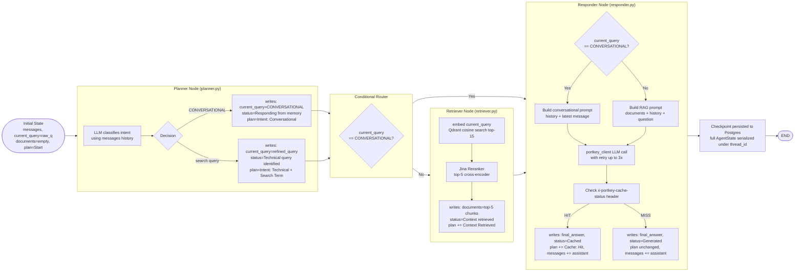
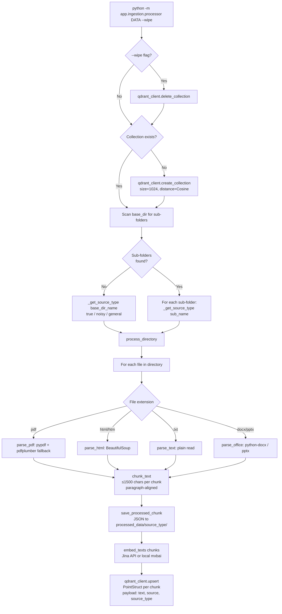
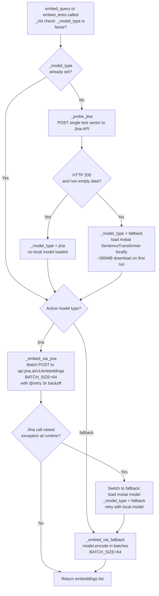
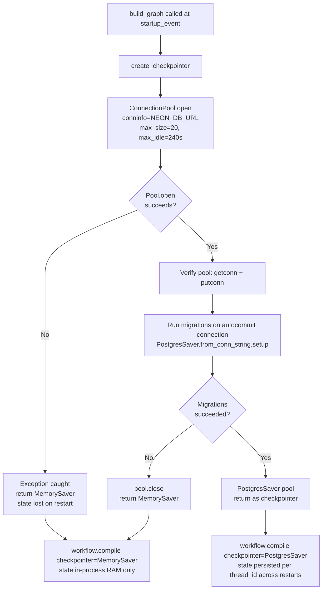
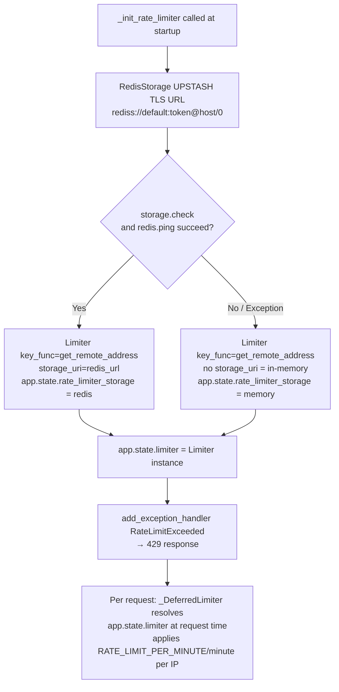
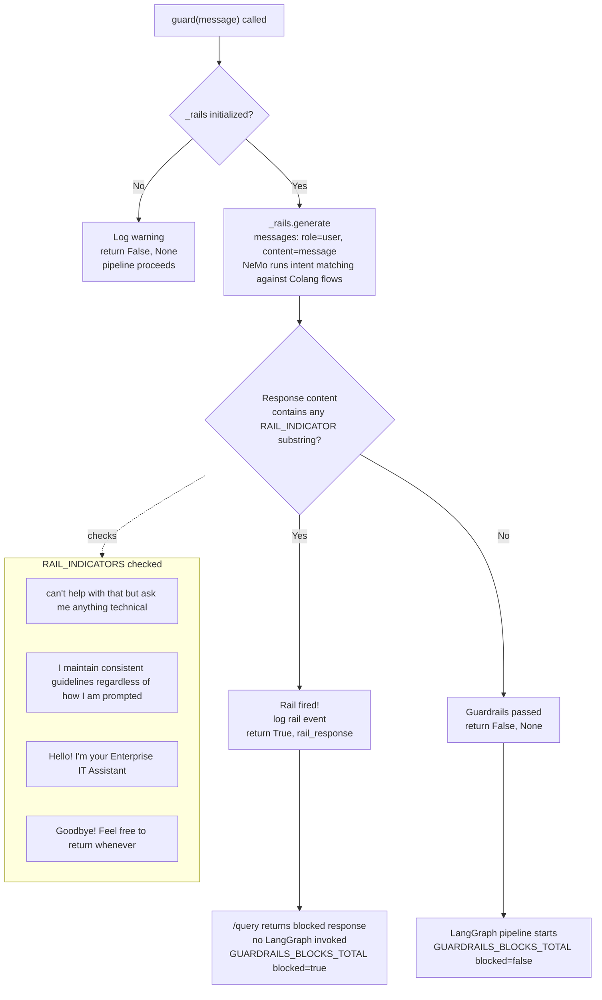

# Enterprise Agentic RAG — Process Flow Graphs

This document contains Mermaid flowcharts detailing the exact actions, processes, and state transitions for each major component of the Enterprise RAG application.

---

## 1. Full Query Flow (HTTP `/query` Route)
**File:** `app/main.py`
This maps the entire lifecycle of a request from the moment it hits the FastAPI server until the response is returned.

---

## 2. LangGraph State Machine — Agent Nodes
**Files:** `app/agents/graph.py`, `app/agents/nodes/*.py`, `app/agents/state.py`
This shows how the `AgentState` is mutated as it passes through the Planner, Retriever, and Responder nodes.

---

## 3. Document Ingestion Pipeline
**File:** `app/ingestion/processor.py`
The offline process for parsing, chunking, embedding, and uploading data to the vector database.

---

## 4. Embedding Provider Fallback Logic
**File:** `app/services/retrieval/embedding.py`
Shows how the system gracefully falls back to a local model if the Jina API is unreachable.

---

## 5. Checkpointer Initialization
**File:** `app/agents/graph.py`
Determines whether to use Neon Postgres for persistent memory or fallback to in-memory testing.

---

## 6. Rate Limiter Startup
**File:** `app/main.py`
Probes Upstash Redis on startup and configures the distributed or local rate limiter.

---

## 7. NeMo Guardrails Execution
**File:** `app/guardrails/rails.py`
Shows how user intents are classified against the Colang flows to block malicious or off-topic questions early.

